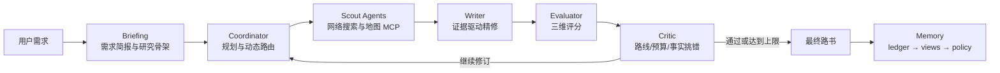

# Travel Guide Generation Agent

基于 LangGraph 的多智能体旅游路书生成系统。系统将用户需求整理、网络情报搜集、路线规划、质量评估和对抗式修订串成可终止的工作流，输出包含景点、交通、住宿、餐饮、预算与预约信息的完整路书。

## 核心能力

- **多智能体协作**：Briefing、Coordinator、Scout、Evaluator、Critic 与 Writer 分工执行。
- **TTD-DR 自进化**：先生成研究骨架，再通过“搜集证据 → 精修 → 评分 → 挑错”循环修订。
- **并行情报搜集**：Coordinator 可并行调度多个 Scout，调用 Tavily 和高德地图 MCP 工具。
- **质量门控**：综合评分与硬规则共同决定是否结束；达到最大轮次仍不合格时输出降级说明和未解决问题。
- **分层记忆**：会话元数据、结构化用户档案、近期摘要和滑动窗口按节点权限读取；可复用成果以 Skill 路径保存。
- **状态防覆盖**：采用 ledger、views、policy 管理持久状态，通过事件时间与记录时间解决乱序复写。

## 工作流



主图节点顺序：

```text
plan_trip_brief
  → write_draft_itinerary
  → coordinator_subgraph
  → final_itinerary_generation
```

## 项目结构

```text
travel_planner/
├── agents/          # Briefing、Coordinator、Scout、Evaluator、Critic
├── mcp/             # 高德地图 FastMCP 服务端与客户端
├── prompts/         # 各节点提示词
├── states/          # LangGraph 共享状态与结构化模型
├── tools/           # 搜索、地图、反思与路书精修工具
├── itinerary_builder.py
└── memory.py        # ledger / views / policy 分层记忆

scripts/
├── ab_test_ttd_dr.py
├── collect_travel_itineraries.py
└── remote_collection.py
```

## 安装

推荐 Python 3.11。

```bash
python -m venv .venv
```

Windows：

```powershell
.venv\Scripts\Activate.ps1
python -m pip install -r requirements.txt
```

Linux/macOS：

```bash
source .venv/bin/activate
python -m pip install -r requirements.txt
```

## 环境变量

复制 `.env.example` 中的变量名，并在操作系统或当前终端中设置真实值。不要把密钥写入 `config.yml`。

```text
OPENAI_API_KEY
TAVILY_API_KEY
AMAP_MAPS_API_KEY
```

PowerShell 示例：

```powershell
$env:OPENAI_API_KEY = "your-key"
$env:TAVILY_API_KEY = "your-key"
$env:AMAP_MAPS_API_KEY = "your-key"
```

模型、角色和超时配置位于 `config.yml`。

## 运行

最直接的方式是打开 `run.ipynb`，按顺序执行环境检查、主图编译和示例请求。

也可以在 Python 中调用主图：

```python
import asyncio

from langchain_core.messages import HumanMessage
from travel_planner.itinerary_builder import agent


async def main():
    result = await agent.ainvoke(
        {
            "messages": [HumanMessage(content="规划西安三天亲子游，预算一万元")],
            "user_id": "demo-user",
            "session_metadata": {"session_id": "demo-session", "channel": "cli"},
        },
        config={"recursion_limit": 100},
    )
    print(result["final_itinerary"])


asyncio.run(main())
```

## 测试

```bash
python -m pip install -r requirements.txt
python -m pytest -q
```

## OpenAI DR 与 TTD-DR 对比

实验脚本使用同一批任务、相同 Scout 上限和独立证据池，对比一次性 `plan-execute-synthesize` 与迭代式 TTD-DR：

```bash
python -m scripts.ab_test_ttd_dr
```

输出包含终稿质量、初稿到终稿提升、冲突/预算/事实缺失率、修订轮数、P95 延迟、最大轮次降级率及盲评文件。`results/` 为本地实验产物，默认不提交 Git。

## 安全说明

- 服务密钥仅从环境变量读取。
- `.env`、运行结果、本地记忆和下载模型均被 Git 忽略。
- 最大迭代次数、Scout 工具预算和并发上限共同防止失控调用。
